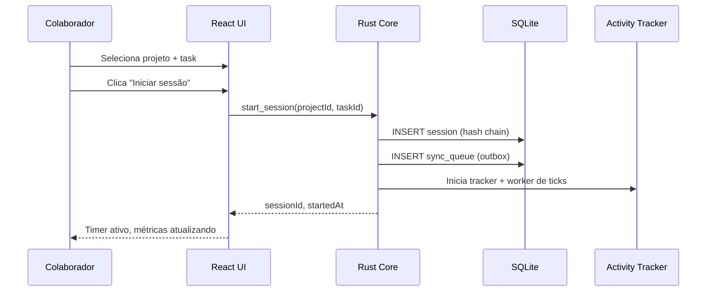
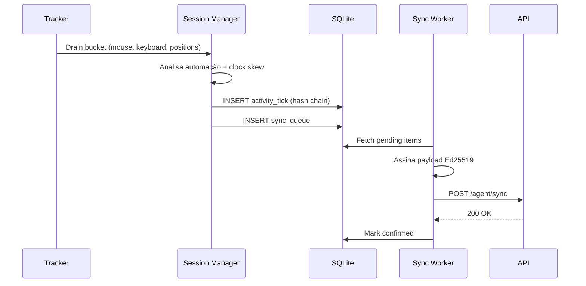

# Voowork — Documentação do Produto

> App desktop oficial do [Voowork](https://voowork.com) para tracking de produtividade em equipes remotas e híbridas.

---

## 1. Visão geral

O **Voowork** é um SaaS de gerenciamento de projetos e monitoramento de produtividade para equipes remotas e autônomos ([voowork.com](https://voowork.com)). A plataforma se divide em **dois produtos complementares**:

| Superfície | Papel | Público |
|----------|------|---------|
| **App web** | Dashboard, relatórios, gestão de equipe, projetos, faturamento | Gestores e colaboradores (visão completa) |
| **App desktop** (este repositório) | Agente leve na máquina do colaborador | Quem registra tempo no dia a dia |

O app desktop **não é um painel de gestão**. É um **timer compacto** que roda em segundo plano: o colaborador inicia a sessão, minimiza para a bandeja, e o agente captura atividade, apps em uso e screenshots enquanto envia tudo para a nuvem.

### Responsabilidades do desktop

1. **Registrar** sessões de trabalho vinculadas a projeto/tarefa.
2. **Capturar** atividade (mouse/teclado agregado), foco de aplicativos e screenshots em background.
3. **Proteger** a integridade dos registros localmente (hash chain, detecção de fraude).
4. **Sincronizar** com o backend de forma resiliente, inclusive offline.

### Princípio de design central

O colaborador deve **aderir sem resistência** — interface limpa, janela pequena, sem parecer vigilância. Ao mesmo tempo, o usuário do computador é tratado como **adversário em potencial** na camada de dados: segurança e integridade são requisitos de primeira classe no core Rust, invisíveis na UI.

---

## 2. Problema que resolve

Empresas que pagam por hora trabalhada enfrentam um dilema clássico em trabalho remoto:

| Desafio | Consequência |
|---------|--------------|
| Falta de visibilidade sobre o que está sendo feito | Horas reportadas sem correspondência real de trabalho |
| Dependência de auto-reporte | Incentivo para inflar tempo ou simular atividade |
| Conectividade instável | Perda de dados ou gaps no histórico |
| Ferramentas facilmente burláveis | Baixa confiança nos relatórios de faturamento |

O Voowork desktop resolve isso combinando **captura automática**, **evidências correlacionadas** (atividade + screenshots + timestamps) e **camadas de detecção de fraude** que sobrevivem à manipulação local do banco de dados.

---

## 3. Público-alvo

### Colaborador rastreado
Usa o **app desktop** apenas para iniciar/parar a sessão de trabalho. A janela é pequena (timer + botão); ao fechar, o app vai para a bandeja e continua capturando em background. Projetos, relatórios e histórico ficam no **painel web**.

### Gestor / administrador
Consome tudo no **app web** do Voowork: dashboard em tempo real, relatórios, horas faturáveis, revisão de evidências. O desktop só envia dados; não exibe métricas de gestão.

### Equipe de engenharia
Mantém o app desktop, integra com a API cloud, evolui as camadas anti-fraude e garante compatibilidade cross-platform (Linux, Windows, macOS via Tauri).

---

## 4. Arquitetura da solução

```
┌─────────────────────────────────────────────────────────────────┐
│                        Máquina do usuário                        │
│                                                                  │
│  ┌──────────────┐    invoke()     ┌──────────────────────────┐  │
│  │  UI React    │ ◄──────────────► │  Core Rust (Tauri 2)     │  │
│  │  Timer       │                  │                          │  │
│  │  compacto    │                  │  • Session manager       │  │
│  └──────────────┘                  │  • Activity tracker      │  │
│                                    │  • App focus             │  │
│  ┌──────────────┐                  │  • Screenshot capture    │  │
│  │  Tray icon   │                  │  • Hash chain + sync       │  │
│  └──────────────┘                  └────────────┬─────────────┘  │
│                                                 │                 │
│                                    ┌────────────▼─────────────┐  │
│                                    │  SQLite local (WAL)      │  │
│                                    │  ~/.local/share/         │  │
│                                    │    voowork-desktop/        │  │
│                                    └────────────┬─────────────┘  │
└─────────────────────────────────────────────────┼────────────────┘
                                                  │ HTTPS + assinatura Ed25519
                                                  ▼
                                    ┌──────────────────────────┐
                                    │  API Voowork (cloud)     │
                                    │  • Valida hash chains    │
                                    │  • Armazena evidências   │
                                    │  • Marca sessões         │
                                    │    suspeitas             │
                                    └──────────────────────────┘
```

### Stack técnica

| Camada | Tecnologia | Papel |
|--------|------------|-------|
| Shell desktop | Tauri 2.x | Janela nativa, tray, IPC com Rust |
| Backend local | Rust | Lógica sensível, captura, integridade |
| UI | React 19 + TypeScript + Vite | Timer compacto + login mínimo |
| Design | Tailwind CSS 4 + tokens Voowork | Janela ~380×520, tema escuro com acento violeta |
| Persistência | SQLite (`rusqlite`) | Fonte de verdade offline |
| Sync | Tokio + reqwest | Worker assíncrono com retry/backoff |
| Input global | `rdev` | Mouse/teclado (contagem, sem keylogging) |
| Screenshots | `xcap` | Captura cross-platform |
| Criptografia | Ed25519 | Assinatura de payloads por dispositivo |

---

## 5. Funcionalidades core

### 5.1 Autenticação e vínculo com organização

**Status:** `parcial` — login e-mail/senha integrado; OAuth e registro de dispositivo pendentes.

O fluxo atual vincula o app a uma conta (`Account` no backend, mapeada como `organization` no desktop) via `POST /api/v1/auth/login`. Tokens JWT (24h) são persistidos no SQLite e validados no boot com `GET /api/v1/auth/me`. Uma chave Ed25519 é gerada localmente no primeiro uso; o registro da chave pública no backend ainda não está implementado.

### 5.2 Sessões de tracking

O núcleo do produto é o ciclo **start → track → stop**:

- O colaborador seleciona **projeto** e **task** ativos.
- Ao iniciar, uma sessão é criada com timestamp absoluto e relógio monotônico.
- O timer usa `Instant` (imune a ajuste manual de relógio) como fonte primária de duração.
- Ao parar, a sessão é finalizada, o bucket de atividade restante é gravado e tudo entra na fila de sync.

O app pode ser **minimizado para a bandeja** — a sessão continua ativa em background.

### 5.3 Captura de atividade (mouse/teclado)

- Eventos globais capturados em thread separada via `rdev`.
- **Nunca** grava conteúdo digitado — apenas contagem agregada por intervalo.
- Amostras de posição do cursor (não conteúdo) para análise de padrões.
- Agregação em **buckets de 60 segundos** (`activity_ticks`).
- Fallback para modo simulado quando `rdev` não tem permissão (desenvolvimento/Linux sem grupo `input`).

### 5.4 Screenshots periódicos

- Captura automática em intervalos **semi-aleatórios** (~5 min + jitter).
- SHA-256 calculado no momento da captura.
- Metadados correlacionados com ticks de atividade no mesmo intervalo.
- Blur opcional planejado para privacidade (placeholder na v1).

### 5.5 Armazenamento local offline-first

Padrão **outbox**:

```
Grava no SQLite → Enfileira em sync_queue → Envia ao backend → Confirma
```

Se offline ou API indisponível, os dados ficam na fila local com retry exponencial (até 1 hora entre tentativas). Nada é perdido.

### 5.6 Sincronização com a nuvem

- Worker assíncrono via runtime do Tauri.
- Cada payload assinado com Ed25519 do dispositivo.
- Endpoint alvo: `{VOOWORK_API_URL}/api/v1/agent/sync`.
- **Hoje desligado** via `BACKEND_SYNC_ENABLED = false` até o backend expor os endpoints de agente.
- Backend valida hash chains antes de aceitar dados; sessões com cadeia quebrada são marcadas como **suspicious** para revisão manual.

---

## 6. Modelo de segurança e anti-fraude

### 6.1 Hash chain local

Cada registro em `sessions` e `activity_ticks` inclui o hash do registro anterior na mesma cadeia — um mini-blockchain local.

```
genesis → sessão₁ → tick₁ → tick₂ → tick₃ → ...
```

Se o usuário editar uma linha via `sqlite3` CLI, a cadeia quebra e fica detectável no sync.

### 6.2 Detecção de manipulação de tempo

A cada tick, compara-se o delta do relógio monotônico (`Instant`) com o delta do wall-clock (`SystemTime`). Divergências grandes indicam alteração manual da hora do sistema para "ganhar" horas.

### 6.3 Detecção de automação (mouse jigglers)

Padrões suspeitos sinalizados por tick:

- Intervalos perfeitamente regulares entre eventos
- Posições idênticas repetidas
- Variância muito baixa nos deltas de tempo

Resultado: `activity_score_confidence` (0.1–1.0) e `automation_flags`. Na v1, **sinaliza** mas não bloqueia — permite revisão posterior pelo gestor.

### 6.4 Autenticidade de screenshots

- Hash SHA-256 no momento da captura.
- Hash incluído no payload de sync.
- Correlação com ticks de atividade: screenshot sem atividade correspondente no intervalo é suspeita.

### 6.5 Fila de sync append-only

A tabela `sync_queue` não permite UPDATE destrutivo em registros já enviados — apenas INSERT de novos eventos e atualização de status de confirmação. Evita reescrita de histórico após falha de sync.

### 6.6 Assinatura do dispositivo

Chave Ed25519 gerada no primeiro uso, armazenada em `device_metadata`. Cada payload de sync é assinado — o backend pode verificar que os dados vieram do app legítimo, não de alguém batendo direto na API.

### 6.7 Proteção do banco local

| Medida | Status |
|--------|--------|
| Diretório protegido do SO (`~/.local/share/voowork-desktop/`) | ✅ |
| Criptografia em repouso (SQLCipher) | ⏳ Planejado |
| Nunca confiar em dados locais para faturamento | ✅ (backend é fonte de verdade) |

---

## 7. Interface do app desktop

### Escopo da UI (v2 — agente timer)

O desktop expõe **apenas**:

| Elemento | Descrição |
|----------|-----------|
| **Login** | Tela compacta de autenticação (primeiro uso) |
| **Timer** | Relógio grande, botão iniciar/encerrar, seletor de projeto/tarefa |
| **Link** | Atalho para o painel web (`voowork.com`) |
| **Bandeja** | Ícone na system tray; fechar janela = minimizar, sessão continua |

**Não faz parte do desktop:** dashboard, gráficos, dados locais, relatórios, configurações avançadas, status de sync, integridade — tudo isso migra para o **app web**.

### Janela

- Tamanho padrão: **380×620 px**, redimensionável.
- Não é fullscreen nem painel administrativo.
- Identidade visual alinhada ao site: escuro, limpo, acento violeta, sem tom de vigilância.

### Comportamento em background

Com sessão ativa e janela fechada/minimizada:

- Tracker de mouse/teclado continua (buckets de 60s).
- Screenshots periódicos continuam.
- Poll de app/janela em foco continua.
- Sync worker envia dados quando online.
- Tray permite reabrir o timer ou sair do app.

### Comunicação UI ↔ Rust

A UI usa o hook `useTrackingSession()` — nunca `invoke()` direto nos componentes. O timer só precisa de: `start_session`, `stop_session`, `get_session_status`, `list_projects`, auth.

---

## 8. Modelo de dados local

### Localização

```
~/.local/share/voowork-desktop/
├── voowork-desktop.db      # SQLite (WAL mode)
└── screenshots/          # PNGs capturados
```

### Tabelas principais

| Tabela | Propósito |
|--------|-----------|
| `device_metadata` | Chaves Ed25519 e identificação do dispositivo |
| `settings` | Preferências (tema, configurações futuras) |
| `sessions` | Sessões de tracking com hash chain |
| `activity_ticks` | Buckets de atividade com confidence e flags |
| `screenshots` | Metadados + SHA-256 + path do arquivo |
| `sync_queue` | Fila outbox append-only com status e retry |

### Estados de sessão

| Status | Significado |
|--------|-------------|
| `active` | Sessão em andamento |
| `stopped` | Finalizada normalmente |
| `suspicious` | Hash chain quebrada — aguarda revisão |
| `synced` | Confirmada pelo backend (futuro) |

---

## 9. Fluxos principais

### 9.1 Iniciar sessão de trabalho



### 9.2 Ciclo de atividade (a cada 60s)



### 9.3 Parar sessão

1. Flush do bucket de atividade restante.
2. Finalização da sessão com `monotonic_ended_ns` e flags de clock skew.
3. Parada do tracker e do worker de ticks/screenshots.
4. Enfileiramento do evento de stop no outbox.

---

## 10. API interna (comandos Tauri)

| Comando | Entrada | Saída |
|---------|---------|-------|
| `start_session` | `{ projectId, taskId? }` | `{ sessionId, startedAt }` |
| `stop_session` | — | — |
| `get_session_status` | — | Timer, eventos, confidence, flags |
| `get_app_status` | — | Sync stats, dispositivo, modo tracker |
| `get_setting` | `{ key }` | `string \| null` |
| `set_setting` | `{ key, value }` | — |
| `list_projects` | — | Lista de projetos/tasks |

---

## 11. Roadmap

O roadmap detalhado por feature — com specs de UI, mocks a remover e checklists — está em **[docs/features/](./features/README.md)**.

### Implementado (v1)

- [x] Estrutura Tauri + Rust modular
- [x] Schema SQLite completo com campos de integridade
- [x] Hash chain para sessions e activity_ticks
- [x] Tracker de atividade com detecção de automação
- [x] Screenshots com SHA-256
- [x] Sync worker com outbox e backoff (código pronto; envio remoto desligado)
- [x] Assinatura Ed25519 por dispositivo
- [x] UI agente timer compacta (login + timer + bandeja)
- [x] Tray icon com minimizar para bandeja
- [x] Login e-mail/senha com API Voowork
- [x] Cache de projetos/tasks da API

### Removido / migrado para app web

- [x] ~~Dashboard, status, dados locais, relatórios no desktop~~ → app web
- [x] ~~Sidebar e navegação multi-tela~~ → app web

### Próximas entregas

- [ ] Endpoints `/api/v1/agent/*` no backend + habilitar `BACKEND_SYNC_ENABLED`
- [ ] Upload de screenshots para storage na nuvem
- [ ] Registro da chave pública no backend no primeiro login
- [ ] Refresh token ou renovação silenciosa de JWT
- [ ] Criptografia do SQLite (SQLCipher)
- [ ] Blur real em screenshots
- [ ] Auto-update do app

---

## 12. Glossário

| Termo | Definição |
|-------|-----------|
| **Sessão** | Período contínuo de tracking vinculado a um projeto/task |
| **Tick** | Bucket de 60s com contagem agregada de atividade |
| **Hash chain** | Sequência de hashes encadeados que detecta edição de registros |
| **Outbox** | Padrão onde dados são gravados localmente antes de sync, garantindo durabilidade |
| **Confidence score** | Probabilidade estimada de que a atividade é humana (não automatizada) |
| **Clock skew** | Divergência entre relógio monotônico e wall-clock, indicando alteração manual de hora |
| **Modo simulado** | Fallback de desenvolvimento quando `rdev` não tem permissão de hardware |
| **Suspicious** | Status de sessão com hash chain quebrada — requer revisão manual |

---

## 13. Referências

- Site institucional: [voowork.com](https://voowork.com)
- Guia de desenvolvimento: [README.md](../README.md)
- Integração com backend: [BACKEND_INTEGRATION.md](./BACKEND_INTEGRATION.md)
- Variável de ambiente: `VOOWORK_API_URL` (padrão dev: `http://localhost:3000`)

---

*Documento mantido pela equipe Voowork. Última atualização: julho/2026.*
