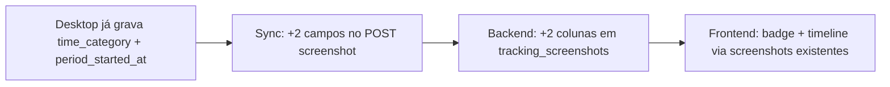

# Plano de implementação (simplificado) — Inatividade no webapp

Adaptar a lógica **já existente** no desktop ao webapp, sem nova tabela, sem novo endpoint e sem mudar a API de timeline.

**Última atualização:** 2026-07-22  
**Relacionado:** [tracking-data-alignment.md](./tracking-data-alignment.md)  
**Substitui:** versão anterior deste plano (com `tracking_inactivity_periods` no PostgreSQL)

---

## 1. Princípio

O desktop **já sabe** quando uma screenshot é de inatividade:

- Coluna local `time_category` (`active` | `inactivity`) em `tracking_screenshots`
- Coluna local `period_started_at` — início do intervalo que a screenshot representa
- Função `screenshot_time_category()` em `tracking/capture.rs`

O webapp **já tem** a estrutura visual pronta:

- Legenda `leave` ("Tempo de Ausência", roxo) em `activity-timeline.tsx` — hoje não usada
- `TimelineCell` renderiza **vários segmentos** na mesma barra
- Dashboard já carrega **timeline + screenshots** em paralelo (`dashboard.tsx`)

O gap é só **sync + exibição**. Não precisamos replicar `tracking_inactivity_periods` no PostgreSQL.

---

## 2. O que NÃO fazer

| Proposta anterior | Por que evitar |
|-------------------|----------------|
| Tabela `tracking_inactivity_periods` no PG | Duplica dado local; novo endpoint; sync novo |
| Service `Reports::TimelineSegments` | Muda contrato da timeline e relatórios agregados |
| `active_seconds` / `inactive_seconds` na API | Muda semântica de totais já deduplicados |
| Novo endpoint ou nested `inactivity_periods` | Fora do padrão atual de sync |

`tracking_inactivity_periods` **permanece local-only** (timer, modal, billable no desktop).

---

## 3. Solução em 3 passos



### Passo 1 — Backend: estender `tracking_screenshots` (igual `activity_level`)

Uma migration, mesmo padrão de `20260722012146_add_is_duplicate_and_activity_level_to_tracking_screenshots.rb`:

| Coluna | Tipo | Default |
|--------|------|---------|
| `time_category` | string | `"active"` |
| `period_started_at` | datetime | `null` |

**Arquivos tocados (~4):**

| Arquivo | Mudança |
|---------|---------|
| `db/migrate/..._add_time_category_to_tracking_screenshots.rb` | Migration |
| `app/models/tracking_screenshot.rb` | Validação + `as_api_json` |
| `app/controllers/api/v1/trackings/screenshots_controller.rb` | Strong params |
| `test/controllers/.../screenshots_controller_test.rb` | Create com `time_category: inactivity` |

Sem alterar `TimelinesController`, rotas, jobs ou relatórios.

### Passo 2 — Desktop: enviar o que já está no SQLite

Hoje o outbox **não inclui** esses campos (`capture.rs` linha ~344):

```json
{
  "activityLevel": "high",
  "isDuplicate": false
}
```

**Adicionar ao payload de enqueue e a `send_tracking_screenshot`:**

```json
{
  "timeCategory": "inactivity",
  "periodStartedAt": "2026-07-22T19:45:00.000Z"
}
```

**Arquivos tocados (~2):**

| Arquivo | Mudança |
|---------|---------|
| `src-tauri/src/tracking/capture.rs` | Incluir no `serde_json::json!` do outbox |
| `src-tauri/src/sync/api.rs` | Mapear para `time_category` / `period_started_at` no body |

Sem mudar outbox, worker, schema SQLite ou sync de `tracking_inactivity_period`.

### Passo 3 — Frontend: consumir dados que já chegam

#### 3a. Badge de screenshot

Em `activity-level-badge.tsx` (ou wrapper mínimo), **priorizar `time_category`:**

| `time_category` | Exibição |
|-----------------|----------|
| `inactivity` | "Tempo inativo" (roxo) |
| `active` / ausente | `activity_level` como hoje |

**Arquivos:** `types.ts`, `activity-level-badge.tsx`, usos em grid/dialog/card.

#### 3b. Timeline — merge no frontend (sem mudar API de timeline)

O dashboard **já** chama:

```ts
ReportsService.timeline(filters)
ScreenshotsService.list({ ...filters, limit: 20 })
```

Alterar assinatura:

```ts
convertToComponentDays(tl.data, screenshots)
```

**Lógica (nova função pura, ~40 linhas):**

```
Para cada TimelineBlock:
  1. Manter segmento base (live | computer) como hoje
  2. Filtrar screenshots onde tracking_id === block.id E time_category === 'inactivity'
  3. Para cada screenshot inativa:
     - leave de period_started_at até captured_at (clip dentro do block)
  4. Ordenar segmentos por hora e renderizar (TimelineCell já suporta)
```

A legenda `leave` (`bg-purple-500`) **já existe** — só passar a usá-la.

**Arquivos tocados (~3):**

| Arquivo | Mudança |
|---------|---------|
| `app/lib/api/types.ts` | `time_category`, `period_started_at` em `Screenshot` |
| `app/components/dashboard/activity-timeline.tsx` | `buildSegmentsFromBlock(block, screenshots)` |
| `app/routes/dashboard.tsx` + `reports.timeline.tsx` | Passar screenshots para `convertToComponentDays` |

---

## 4. Escopo por repositório

| Repo | Arquivos | Esforço |
|------|----------|---------|
| **backend** | ~4 | ~2h |
| **desktop** | ~2 | ~1h |
| **frontend** | ~5 | ~3h |
| **Total** | **~11 arquivos** | **~1 dia** |

Comparado ao plano anterior: **~11 arquivos vs dezenas**, **1 dia vs 4–7 dias**.

---

## 5. Limitações aceitas (trade-off consciente)

| Aspecto | Comportamento |
|---------|---------------|
| Granularidade da timeline | Roxo aparece nos **intervalos entre screenshots** (`period_started_at` → `captured_at`), não no segundo exato do modal |
| Período sem screenshot | Se o usuário resolver inatividade antes da próxima captura, pode não aparecer faixa roxa |
| Totais da coluna "Tempo" | Continuam sendo wall clock deduplicado (comportamento atual) |
| Relatórios `task_time` / `counters` | Sem alteração |
| Histórico antigo | Screenshots sem `time_category` → tratadas como `active` |

Isso é suficiente para o caso validado (sessão `b2b69f59` com ~258s inativos e screenshots no período).

Se no futuro precisar de precisão ao segundo ou totais faturáveis no webapp, aí sim avaliar sync de `tracking_inactivity_periods` — **fora deste escopo**.

---

## 6. Critérios de aceite

### Screenshots

- [ ] Screenshot em `PausedInactivity` sobe com `time_category: inactivity`
- [ ] Grid/dialog mostram "Tempo inativo", não "Alta atividade"
- [ ] Registros antigos defaultam para `active`

### Timeline

- [ ] Bloco de tracking ativo mostra verde + roxo quando há screenshots inativas no intervalo
- [ ] Legenda "Tempo de Ausência" aparece na barra
- [ ] Sem screenshots inativas → barra verde única (igual hoje)

### Não-regressão

- [ ] `GET /api/v1/reports/timeline` — contrato JSON inalterado
- [ ] Sync de apps, sites, peripheral_events — inalterado
- [ ] `tracking_inactivity_period` continua local-only

---

## 7. Ordem de implementação

1. **Backend** — migration + `as_api_json` + strong params + teste
2. **Desktop** — 2 campos no outbox e no POST
3. **Frontend** — tipos → badge → timeline merge
4. **Smoke** — sessão com inatividade → conferir API + UI

---

## 8. Verificação

```bash
# Backend
DATABASE_TEST_NAME=voowork_test bin/rails test \
  test/controllers/api/v1/trackings/screenshots_controller_test.rb

# Desktop
cargo check --manifest-path src-tauri/Cargo.toml

# Frontend
npm run typecheck
```

**Smoke manual:**

1. Tracking ativo → ficar inativo → modal "Tempo inativo"
2. Aguardar ≥1 screenshot → clicar "Não estava"
3. `GET /api/v1/screenshots` → `time_category: "inactivity"`
4. Dashboard → badge roxo + faixa roxa na timeline no horário da captura

---

## 9. Documentação a atualizar (mínimo)

| Arquivo | O quê |
|---------|-------|
| `voowork-backend/docs/screenshots-api.md` | Campos `time_category`, `period_started_at` |
| `voowork-desktop/docs/features/03-sync.md` | Payload de screenshot com 2 campos novos |
| `voowork-desktop/docs/alignment/tracking-data-alignment.md` | Nota: inatividade no webapp via screenshot, não via períodos |

OpenAPI e `db.mermaid` do backend: atualizar **só** se o time já faz isso em toda migration de screenshot (opcional neste escopo).

---

## 10. Referências de código

### Já implementado (reutilizar)

| O quê | Onde |
|-------|------|
| `time_category` local | `tracking/capture.rs` → `screenshot_time_category()` |
| `period_started_at` local | `screenshot/mod.rs`, migrations em `db/mod.rs` |
| Legenda `leave` | `activity-timeline.tsx` → `DEFAULT_ACTIVITIES.leave` |
| Multi-segmento na barra | `activity-timeline.tsx` → `TimelineCell` |
| Fetch paralelo timeline + screenshots | `dashboard.tsx` |

### Onde o sync falha hoje

| Arquivo | Linha / trecho |
|---------|----------------|
| `sync/api.rs` | Body sem `time_category` |
| `capture.rs` | Outbox JSON sem `timeCategory` / `periodStartedAt` |
| `activity-timeline.tsx` | `convertToComponentDays` ignora screenshots |
| `activity-level-badge.tsx` | Só `activity_level` |
