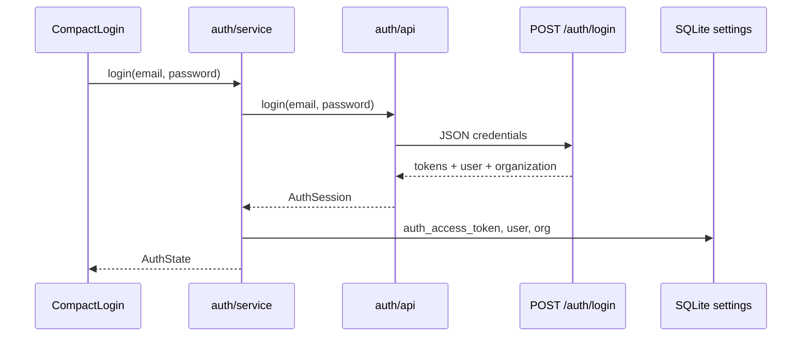

# 01 — Autenticação

| Campo | Valor |
|-------|-------|
| **Status** | `real` (login); `parcial` (refresh, registro de dispositivo) |
| **Prioridade** | `P0` |

## Visão geral

Vincula o agente a uma conta e organização no Voowork via API. O app expõe login compacto (e-mail/senha); tokens e sessão ficam persistidos localmente para o sync worker consumir.

## Fluxo



## Contrato da API

`POST {VOOWORK_API_URL}/api/v1/auth/login`

**Request:**
```json
{ "auth": { "email": "user@empresa.com", "password": "..." } }
```

**Response (200):**
```json
{
  "token": "jwt...",
  "user": { "id": "...", "name": "...", "email": "...", "account_id": "..." },
  "account": { "id": "...", "name": "..." }
}
```

O desktop mapeia `account` → `organization` e persiste `token` como `auth_access_token`. Não há `refreshToken` no backend atual.

Validação no boot: `GET /api/v1/auth/me` com `Authorization: Bearer <token>`.

**Erros:** repassados da API no padrão Rails (`errors`, `error`, `message`) — sem validação duplicada no agente.

## Comandos Tauri

| Comando | Entrada | Saída |
|---------|---------|-------|
| `login` | `{ email, password }` | `AuthState` (async) |
| `logout` | — | — |
| `get_auth_state` | — | `AuthState` |

## Dados persistidos

| Chave | Conteúdo |
|-------|----------|
| `auth_authenticated` | `"true"` / `"false"` |
| `auth_access_token` | JWT para requests autenticados |
| `auth_refresh_token` | Token de renovação (opcional) |
| `auth_user_json` | `{ id, name, email }` |
| `auth_org_json` | `{ id, name }` |

## Arquivos principais

| Camada | Arquivo |
|--------|---------|
| UI | `src/components/compact-login.tsx` |
| Hook | `src/hooks/use-auth.ts` |
| Comandos | `src-tauri/src/auth/commands.rs` |
| Serviço | `src-tauri/src/auth/service.rs` (`login`, `logout`, `validate`) |
| Cliente HTTP | `src-tauri/src/auth/api.rs` (`LoginClient::fetch_session`) |
| Persistência | `src-tauri/src/auth/store.rs` (`persist_session`, `read_session`) |
| Constantes | `src-tauri/src/auth/constants.rs` (keys, URLs, timeout) |
| Erros HTTP | `src-tauri/src/auth/http_errors.rs` |
| Modelos | `src-tauri/src/auth/models.rs` |

## Configuração

| Variável | Efeito |
|----------|--------|
| `VOOWORK_API_URL` | Base da API; vazio em dev bloqueia login |

## Próximos passos

- [ ] Refresh token automático
- [ ] Registrar `public_key` do dispositivo no login
- [ ] Sync worker enviar `Authorization: Bearer` com `auth_access_token`
- [ ] Logout chamar endpoint de revogação (se existir)

## Edge cases

- **API não configurada:** erro claro — não há fallback mock.
- **Token expirado:** renovar ou forçar re-login.
- **Sessão corrompida no SQLite:** `get_auth_state` retorna não autenticado.

## Relacionado

- [07-device-registration.md](./07-device-registration.md)
- [06-sync-and-offline.md](./06-sync-and-offline.md)
