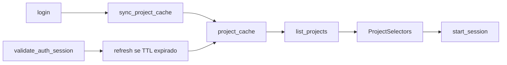

# 02 — Projetos e tarefas

| Campo | Valor |
|-------|-------|
| **Status** | `real` |
| **Prioridade** | `P0` |

## Visão geral

Antes de iniciar uma sessão, o colaborador seleciona **projeto** e opcionalmente **tarefa**. O app oferece apenas um par de seletores no timer — sem criação, edição ou atribuição de projetos.

## Escopo do app

| Capacidade | Suportado |
|------------|-----------|
| Listar projetos atribuídos | ✅ Cache local |
| Seletor no timer | ✅ |
| Criar/editar projetos ou tasks | ❌ |
| Sincronizar cache com API | ✅ Após login + refresh TTL |

## Fluxo atual



1. Após login, `sync_project_cache` busca projetos em `GET /auth/me` e tasks por projeto.
2. No boot, `validate_auth_session` dispara refresh em background se o cache tiver mais de 15 min.
3. Troca de organização invalida o cache antes do próximo sync.
4. `TimerApp` chama `list_projects` ao montar e após autenticação.
5. Colaborador escolhe projeto + task opcional.
6. `start_session(projectId, taskId?)` valida cache e vincula a sessão.

## Comando Tauri

| Comando | Entrada | Saída |
|---------|---------|-------|
| `list_projects` | — | `ProjectOption[]` |

```typescript
type ProjectOption = {
  id: string
  name: string
  tasks: { id: string; name: string }[]
}
```

## Modelo de dados

Tabela `project_cache`:

| Coluna | Tipo | Descrição |
|--------|------|-----------|
| `id` | TEXT PK | ID do projeto (mesmo da API) |
| `name` | TEXT | Nome exibido |
| `tasks_json` | TEXT | Array JSON de tasks |
| `sort_order` | INTEGER | Ordem no seletor |
| `updated_at` | TEXT | Última atualização do cache |

## Arquivos principais

| Camada | Arquivo |
|--------|---------|
| Orquestração | `src-tauri/src/projects/mod.rs` — `sync_project_cache`, `refresh_project_cache_if_stale` |
| Cache / TTL | `src-tauri/src/projects/cache.rs` — TTL, invalidação por org, guard de start |
| Constantes | `src-tauri/src/projects/constants.rs` — `PROJECT_CACHE_TTL_SECS` (900s) |
| API HTTP | `src-tauri/src/projects/api.rs` — `ProjectsClient` |
| Cache SQLite | `src-tauri/src/db/projects.rs` — `list_projects`, `upsert_project` |
| Seed (demo) | `src-tauri/src/seed.rs` |
| Comando | `src-tauri/src/commands/projects.rs` |
| UI | `src/components/timer-app-sections.tsx` (`ProjectSelectors`) |
| Hook | `src/hooks/use-tracking-session.ts` |

## Comportamento esperado (alvo)

- [x] Fetch de projetos da API após login (`GET /auth/me` + `GET /tasks`)
- [x] Cache local com TTL e refresh em background (15 min)
- [x] Invalidar cache ao trocar organização
- [x] Task opcional — sessão pode iniciar só com projeto
- [ ] Projetos arquivados não aparecem no seletor (backend ainda sem campo `archived`)

## Edge cases

- **Lista vazia:** exibir mensagem orientando a solicitar atribuição de projeto.
- **Projeto removido durante sessão:** sessão mantém `project_id` original; sync envia ID histórico.
- **Offline:** usar último cache conhecido; bloquear start se cache nunca foi populado.

## Relacionado

- [03-session-tracking.md](./03-session-tracking.md) — sessão vinculada a projeto/task
- [01-authentication.md](./01-authentication.md) — projetos dependem de org autenticada
