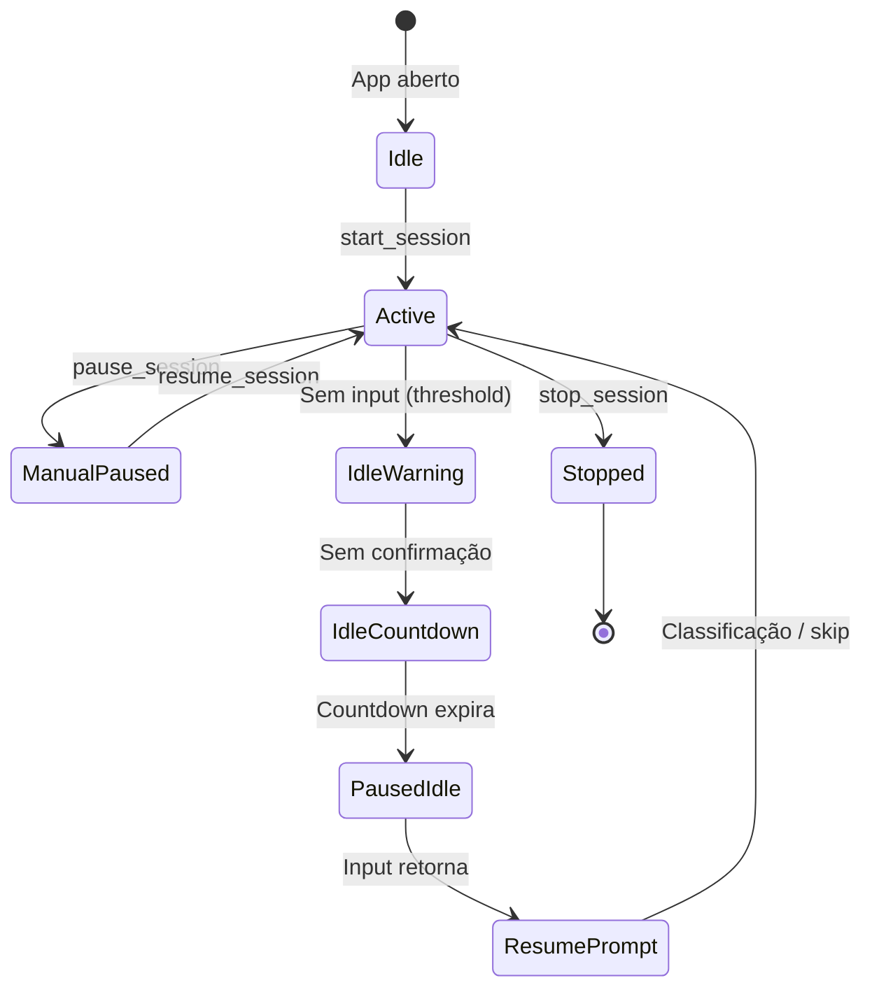
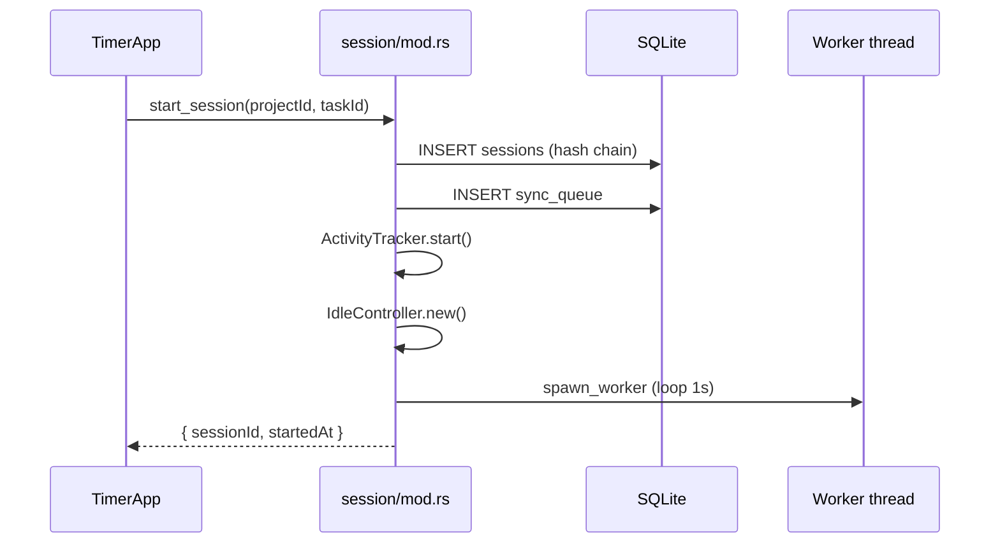

# 03 — Sessão de tracking

| Campo | Valor |
|-------|-------|
| **Status** | `real` |
| **Prioridade** | `P0` |

## Visão geral

Núcleo do produto. O colaborador inicia uma **sessão de trabalho** vinculada a projeto/task; o core Rust orquestra captura em background até o stop. A UI mostra timer, controles e overlay de idle.

## Ciclo de vida

## Fluxo start

## Fluxo stop

1. Flush do bucket de atividade restante.
2. `ActivityTracker.stop()`.
3. Finaliza sessão (`monotonic_ended_ns`, status `stopped`).
4. Encerra worker thread.
5. Enfileira evento de stop no outbox.

## Worker (loop a cada 1s)

| Intervalo | Ação |
|-----------|------|
| Contínuo | Verifica clock skew |
| 15s | Poll app/janela em foco |
| 60s | Flush activity tick |
| ~300s ± 60s | Screenshot (jitter) |
| Contínuo | `idle.tick()` + emite evento `idle-changed` |

**Primeiro tick:** 5s após start (não espera 60s).
**Primeiro screenshot:** 5s após start.

## Comandos Tauri

| Comando | Descrição |
|---------|-----------|
| `start_session` | Inicia sessão com projeto/task |
| `stop_session` | Para sessão ativa |
| `get_session_status` | Estado completo para UI |
| `pause_session` | Pausa manual |
| `resume_session` | Retoma após pausa manual |
| `confirm_still_working` | Confirma presença no countdown idle |
| `classify_idle_period` | Classifica período idle ao retornar |
| `skip_idle_classification` | Descarta classificação |
| `get_idle_config` | Threshold e perfil idle |

## SessionStatus (UI)

Exposto via `get_session_status` e hook `useTrackingSession()`:

- `active`, `sessionId`, `projectId`, `taskId`, `startedAt`
- `elapsedSeconds` (baseado em `Instant`, imune a ajuste de relógio)
- `mouseEvents`, `keyboardEvents`, `activityConfidence`
- `clockSkewDetected`, `trackerMode`
- `currentApp`, `currentWindowTitle`
- `screenshotCount`, `lastScreenshotAt`
- `idle` — snapshot completo da máquina de estados idle

## Detecção de inatividade (idle)

Máquina de estados integrada à sessão:

| Fase | Comportamento |
|------|---------------|
| `active` | Tracking normal |
| `warning` | Sem input por threshold (padrão 2 min) |
| `countdown` | 60s para confirmar presença na UI |
| `paused_idle` | Tempo descartado; billing pausado |
| `resume_prompt` | Input retornou; pede classificação |
| `manual_paused` | Pausa explícita do colaborador |

**Perfis de threshold** (`idle_profile`):

| Perfil | Threshold |
|--------|-----------|
| `standard` | 2 min |
| `data_entry` | 3 min |
| `knowledge` | 15 min |
| `meeting_heavy` | 30 min |

**Isenção em reunião:** apps de comunicação (Zoom, Teams, etc.) ativam `meeting_exempt` — idle não dispara durante call.

**Importante:** input global **não** cancela countdown — apenas confirmação explícita na UI (`confirm_still_working`).

## Modelo de dados

Tabela `sessions`:

| Coluna | Descrição |
|--------|-----------|
| `monotonic_started_ns` / `monotonic_ended_ns` | Duração via `Instant` |
| `prev_hash` / `record_hash` | Hash chain |
| `clock_skew_flags` | Flags de manipulação de relógio |
| `status` | `active` · `stopped` · `suspicious` |

Tabela `idle_periods` — um registro por período idle com classificação e segundos descartados/reclassificados.

## Arquivos principais

| Camada | Arquivo |
|--------|---------|
| Orquestração | `src-tauri/src/session/mod.rs` |
| Constantes | `src-tauri/src/session/constants.rs` |
| Worker | `src-tauri/src/session/worker.rs` |
| Captura | `src-tauri/src/session/capture.rs` |
| Notificações idle | `src-tauri/src/session/notifications.rs` |
| UI idle | `src-tauri/src/session/idle_ui.rs` |
| Idle (state machine) | `src-tauri/src/idle/state.rs` |
| Idle (persistência) | `src-tauri/src/idle/persistence.rs` |
| Idle (constantes) | `src-tauri/src/idle/constants.rs` |
| UI timer | `src/components/timer-app.tsx` |
| UI controles | `src/components/timer-app-sections.tsx` |
| UI idle | `src/components/idle-overlay.tsx` |
| Hook | `src/hooks/use-tracking-session.ts` |
| Display idle | `src/lib/idle-display.ts` |

## Recuperação de sessões órfãs

Se o app crashar com sessão `active` no banco, o boot detecta e oferece finalizar ou retomar (comportamento em `session/mod.rs`).

## Edge cases

- **Segunda sessão:** `start_session` com sessão ativa retorna erro.
- **Clock skew:** flags gravadas na sessão e nos ticks; não bloqueia tracking na v1.
- **Janela fechada:** sessão continua — ver [09-tray-and-system.md](./09-tray-and-system.md).

## Relacionado

- [04-activity-monitoring.md](./04-activity-monitoring.md)
- [05-screenshots.md](./05-screenshots.md)
- [06-sync-and-offline.md](./06-sync-and-offline.md)
