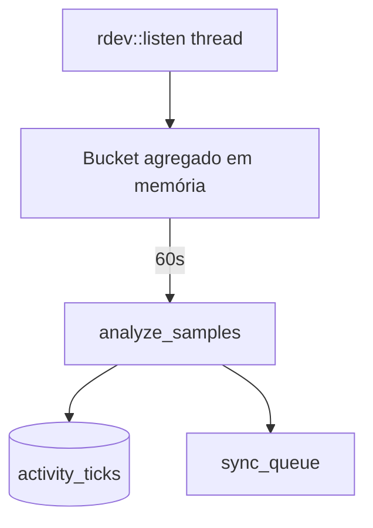
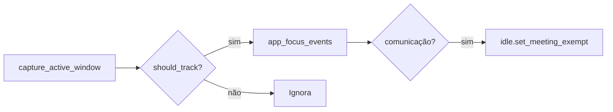

# 04 — Monitoramento de atividade

| Campo | Valor |
|-------|-------|
| **Status** | `real` |
| **Prioridade** | `P0` |
## Visão geral

Captura **atividade agregada** de mouse e teclado em background, sem keylogging. Também inclui **rastreamento de app/janela em foco** — correlacionando tempo com ferramentas usadas.

## Princípio de privacidade

- **Nunca** grava conteúdo digitado.
- Apenas contagem de eventos + amostras de posição do cursor.
- Títulos de janela podem conter dados sensíveis — filtrados parcialmente (ver app focus).

## Atividade mouse/teclado

### Arquitetura



### Modos de tracker

| Modo | Quando |
|------|--------|
| `hardware` | `rdev` com permissão (grupo `input` no Linux) |
| `simulated` | Sem permissão — eventos sintéticos para dev |

Detectado via `get_tracking_capabilities` e exposto em `SessionStatus.trackerMode`.

### Bucket de 60 segundos

Cada `activity_tick` contém:

| Campo | Descrição |
|-------|-----------|
| `mouse_events` | Contagem de eventos de mouse |
| `keyboard_events` | Contagem de teclas |
| `mouse_positions_json` | Amostras de posição (não conteúdo) |
| `activity_score_confidence` | 0.1–1.0 — probabilidade de atividade humana |
| `automation_flags` | Bitmask de padrões suspeitos |
| `monotonic_elapsed_ns` | Tempo monotônico no tick |
| `wall_clock_at_tick` | Wall-clock para comparação |
| `clock_skew_detected` | Divergência monotônico vs wall-clock |
| `prev_hash` / `record_hash` | Hash chain |

### Detecção de automação (mouse jigglers)

Sinais analisados em `activity/automation.rs`:

- Intervalos perfeitamente regulares entre eventos
- Posições idênticas repetidas
- Variância muito baixa nos deltas de tempo

**v1:** sinaliza via `activity_score_confidence` e `automation_flags` — **não bloqueia** tracking.

## App/janela em foco

Poll a cada **15 segundos** via `active-win-pos-rs`.



### Filtros (não rastreados)

- O próprio Voowork
- Gerenciadores de arquivos
- UI de sistema (painéis, launchers)

### Apps de comunicação

Zoom, Teams, Google Meet, etc. → isentam detecção de idle durante a call.

## Modelo de dados

Tabela `app_focus_events`:

| Coluna | Descrição |
|--------|-----------|
| `app_name` | Nome do processo/app |
| `window_title` | Título da janela (pode ser filtrado) |
| `process_path` | Caminho do executável |
| `process_id` | PID |
| `captured_at` | Timestamp ISO 8601 |

**Sync:** eventos ficam apenas no SQLite local — não são enfileirados na `sync_queue` na versão atual.

## Arquivos principais

| Módulo | Arquivo |
|--------|---------|
| Tracker | `src-tauri/src/activity/tracker.rs` |
| Constantes | `src-tauri/src/activity/constants.rs` |
| Automação | `src-tauri/src/activity/automation.rs` |
| App focus | `src-tauri/src/app_focus/mod.rs` |
| Permissões | `src-tauri/src/permissions.rs` |
| Clock skew | `src-tauri/src/clock/mod.rs` |
| Integridade | `src-tauri/src/integrity/hash_chain.rs` |

## Comandos auxiliares

| Comando | Uso |
|---------|-----|
| `list_activity_ticks` | Lista ticks de uma sessão (debug) |
| `list_app_focus` | Lista eventos de foco (debug) |
| `get_tracking_config` | Configuração de tracking |
| `get_tracking_capabilities` | Capacidades do SO |

## Permissões Linux

Para modo `hardware`:

```bash
sudo usermod -aG input $USER
# logout/login necessário
```

Sem permissão → modo `simulated` (adequado para dev, inadequado para produção).

## Edge cases

- **Sessão pausada (idle/manual):** ticks não são gravados durante pausa.
- **Múltiplos monitores:** posições absolutas na tela virtual.
- **App focus indisponível:** poll falha silenciosamente; sessão continua.

## Relacionado

- [03-session-tracking.md](./03-session-tracking.md) — orquestração
- [05-screenshots.md](./05-screenshots.md) — correlação tick ↔ screenshot
- [08-integrity-and-security.md](./08-integrity-and-security.md) — hash chain e automação
