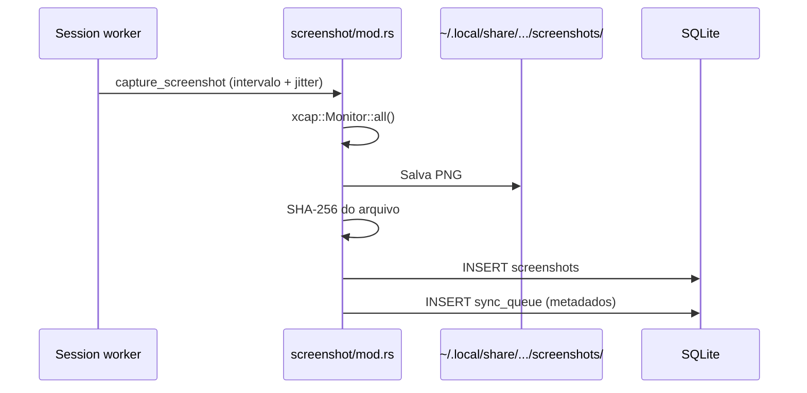

# 05 — Screenshots

| Campo | Valor |
|-------|-------|
| **Status** | `real` (captura) · `parcial` (upload/blur) |
| **Prioridade** | `P1` |
## Visão geral

Captura periódica de tela como evidência correlacionada com atividade. Intervalo semi-aleatório para dificultar previsão. Hash SHA-256 garante integridade desde a captura.

## Fluxo de captura



## Timing

| Evento | Intervalo |
|--------|-----------|
| Primeira captura | 5s após start da sessão |
| Capturas seguintes | ~300s ± 60s de jitter |
| Override | `VOOWORK_SCREENSHOT_INTERVAL_SECS` (mín. 10s) |

## Modelo de dados

Tabela `screenshots`:

| Coluna | Descrição |
|--------|-----------|
| `file_path` | Caminho local do PNG |
| `sha256_hash` | Hash calculado na captura |
| `width` / `height` | Dimensões |
| `captured_at` | Timestamp |
| `activity_tick_id` | Correlação com tick do mesmo intervalo |
| `blur_applied` | Flag de blur (placeholder na v1) |
| `synced_at` | Quando upload confirmado (futuro) |

## Armazenamento local

```
~/.local/share/voowork-agent/screenshots/
└── {session_id}_{timestamp}.png
```

Arquivos permanecem locais até upload para storage na nuvem ser implementado.

## Integridade

- SHA-256 calculado **no momento da captura**, antes de qualquer processamento.
- Hash incluído no payload de sync.
- Screenshot sem atividade correspondente no intervalo → sinal suspeito (validação server-side planejada).

## Blur de privacidade

| Status | Detalhe |
|--------|---------|
| `blur_applied` | Coluna existe, sempre `0` na v1 |
| Processamento | Placeholder em `screenshot/mod.rs` via crate `image` |
| Alvo | Blur configurável via política da API |

## Arquivos principais

| Camada | Arquivo |
|--------|---------|
| Captura | `src-tauri/src/screenshot/mod.rs` |
| Constantes | `src-tauri/src/screenshot/constants.rs` |
| Orquestração | `src-tauri/src/session/capture.rs` |
| Schema | `src-tauri/src/db/schema.rs` |

## Comando legado

| Comando | Uso |
|---------|-----|
| `list_screenshots` | Lista metadados de uma sessão (debug) |

## Comportamento esperado (alvo)

- [ ] Upload multipart para storage S3/GCS via API
- [ ] Blur real antes do upload (regiões sensíveis)
- [ ] Política por organização: intervalo, blur, desabilitar screenshots
- [ ] Limpeza local após upload confirmado (retenção configurável)
- [ ] Multi-monitor: captura tela primária ou todas (decisão de produto)

## Edge cases

- **Permissão de captura negada:** log de erro; sessão continua sem screenshots.
- **Disco cheio:** falha na captura; retry no próximo intervalo.
- **Sessão em idle pausado:** capturas podem continuar ou pausar (comportamento atual: continua).

## Relacionado

- [04-activity-monitoring.md](./04-activity-monitoring.md) — correlação com ticks
- [06-sync-and-offline.md](./06-sync-and-offline.md) — envio de metadados
- [08-integrity-and-security.md](./08-integrity-and-security.md) — SHA-256 na captura
