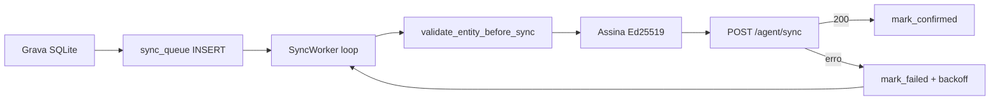

# 06 — Sync e offline

| Campo | Valor |
|-------|-------|
| **Status** | `parcial` |
| **Prioridade** | `P0` |
## Visão geral

Padrão **offline-first** com outbox: dados gravados localmente primeiro, enviados depois com retry resiliente. O backend é a fonte de verdade para faturamento — dados locais nunca são confiáveis isoladamente.

## Fluxo outbox

## Worker assíncrono

Runtime Tokio iniciado no setup do Tauri (`app_state.rs`).

| Parâmetro | Valor |
|-----------|-------|
| Batch size | 10 itens por ciclo |
| Backoff | `2^attempts` segundos, máx. 3600s |
| Endpoint | `{VOOWORK_API_URL}/api/v1/agent/sync` |
| Habilitação | `BACKEND_SYNC_ENABLED = true` **e** `VOOWORK_API_URL` configurada |

O worker **não inicia** enquanto `BACKEND_SYNC_ENABLED` for `false` (estado atual), independentemente da URL.

## Entity types na fila

| `entity_type` | Origem |
|---------------|--------|
| `session` | Start/stop de sessão |
| `activity_tick` | Buckets de 60s |
| `screenshot` | Metadados + hash |
| `idle_period` | Períodos de inatividade |

> `app_focus` é gravado em `app_focus_events` mas **não** é enfileirado na `sync_queue` hoje.

## Validação pré-sync

Antes de enviar `activity_tick`:

1. `validate_activity_chain` verifica hash chain da sessão.
2. Cadeia quebrada → sessão marcada `suspicious`, item não enviado.

## Payload assinado

Cada item inclui:

- `payload_json` — dados da entidade
- `signature` — Ed25519 via `DeviceKeys::sign_payload()`

## Modelo de dados

Tabela `sync_queue`:

| Coluna | Descrição |
|--------|-----------|
| `entity_type` / `entity_id` | Referência à entidade |
| `payload_json` | Dados serializados |
| `signature` | Assinatura Ed25519 |
| `status` | `pending` · `sending` · `confirmed` · `failed` |
| `attempts` | Contador de tentativas |
| `next_retry_at` | Próxima tentativa (backoff) |
| `error_message` | Último erro |
| `confirmed_at` | Confirmação do backend |

**Append-only:** payloads não são reescritos após envio — apenas status atualizado.

## Arquivos principais

| Responsabilidade | Arquivo |
|------------------|---------|
| Re-exports | `src-tauri/src/sync/mod.rs` |
| Constantes | `src-tauri/src/sync/constants.rs` |
| Outbox / fila | `src-tauri/src/sync/outbox.rs` |
| HTTP (sync + upload) | `src-tauri/src/sync/api.rs` |
| Validação pré-sync | `src-tauri/src/sync/validation.rs` |
| Worker | `src-tauri/src/sync/worker.rs` |
| Estado / bootstrap | `src-tauri/src/app_state.rs` |
| Hash chain | `src-tauri/src/integrity/hash_chain.rs` |
| Cripto | `src-tauri/src/crypto/mod.rs` |

Flag principal: `BACKEND_SYNC_ENABLED` em `src-tauri/src/sync/constants.rs`.

## Variáveis de ambiente

| Variável | Padrão | Efeito |
|----------|--------|--------|
| `VOOWORK_API_URL` | `https://api.voowork.com` (release) / vazio (dev) | URL do backend |

## Comandos

| Comando | Uso |
|---------|-----|
| `get_app_status` | Stats de sync, dispositivo, tracker |
| `list_sync_queue` | Lista fila (legado/debug) |

## Comportamento esperado (alvo)

- [ ] Auth JWT no header das requests
- [ ] Endpoint real validado com backend Voowork
- [ ] Confirmação server-side da hash chain
- [ ] Upload de screenshots em endpoint separado
- [ ] Idempotência por `entity_id` no backend

## Edge cases

- **Offline prolongado:** fila cresce indefinidamente; sem perda de dados.
- **Backend rejeita payload:** item fica `failed` com mensagem; retry até limite (futuro).
- **App fechado com fila pendente:** dados persistem no SQLite; worker retoma no próximo boot.

## Relacionado

- [07-device-registration.md](./07-device-registration.md) — assinatura
- [01-authentication.md](./01-authentication.md) — token de API
- [08-integrity-and-security.md](./08-integrity-and-security.md) — validação pré-sync
