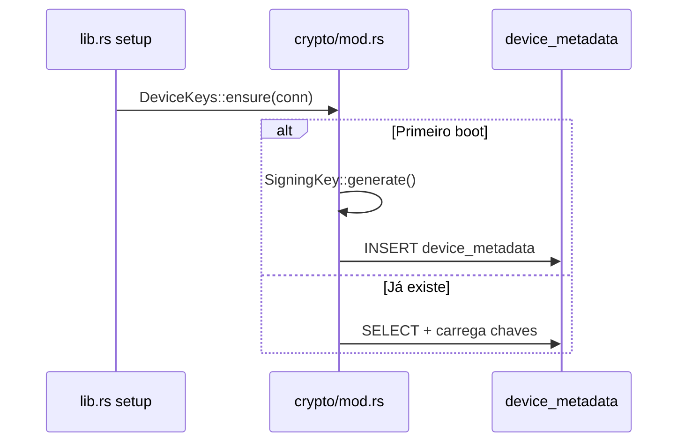

# 07 — Registro de dispositivo

| Campo | Valor |
|-------|-------|
| **Status** | `real` (local) · `parcial` (registro no backend) |
| **Prioridade** | `P0` |

## Visão geral

Cada instalação do agente gera um par de chaves **Ed25519** único. A chave privada fica local; a pública será registrada no backend no primeiro login real. Todos os payloads de sync são assinados — provando que vieram do binário legítimo.

## Fluxo de bootstrap



Executado automaticamente no `setup()` do Tauri — sem interação do usuário.

## Modelo de dados

Tabela `device_metadata`:

| Coluna | Descrição |
|--------|-----------|
| `id` | UUID do dispositivo |
| `device_name` | Hostname (`HOSTNAME` env ou `voowork-device`) |
| `public_key` | Chave pública Ed25519 (hex) |
| `private_key_b64` | Chave privada (base64, local only) |
| `registered_at` | Quando registrado no backend (null na v1) |
| `created_at` / `updated_at` | Timestamps |

## Assinatura de payloads

```rust
// Simplificado
let payload_str = serde_json::to_string(&payload)?;
let signature = signing_key.sign_payload(&payload_str);
// INSERT sync_queue com signature
```

Backend validará: `verify(public_key, payload, signature)`.

## Arquivos principais

| Módulo | Arquivo |
|--------|---------|
| Cripto | `src-tauri/src/crypto/mod.rs` |
| Setup | `src-tauri/src/lib.rs` |
| Enfileiramento | `src-tauri/src/sync/mod.rs` |

## Comportamento esperado (alvo)

- [ ] `POST /agent/register` no primeiro login com `public_key` + `device_name`
- [ ] `registered_at` preenchido após confirmação
- [ ] Rotação de chaves (reinstalação = novo dispositivo)
- [ ] Revogação de dispositivo via API
- [ ] Chave privada protegida (keychain do SO, futuro)

## Segurança

| Aspecto | Status |
|---------|--------|
| Chave privada nunca sai do dispositivo | ✅ |
| Assinatura em todo payload de sync | ✅ |
| Proteção da chave privada em repouso | ⏳ Keychain |
| SQLCipher no banco | ⏳ Planejado |

## Edge cases

- **Reinstalação:** novo par de chaves; dispositivo tratado como novo no backend.
- **Clone de VM com mesmo banco:** mesma identidade — risco aceito na v1; mitigação futura via hardware attestation.
- **Banco corrompido:** `ensure()` regenera chaves se metadata ausente.

## Relacionado

- [01-authentication.md](./01-authentication.md) — registro no login
- [06-sync-and-offline.md](./06-sync-and-offline.md) — assinatura na fila
