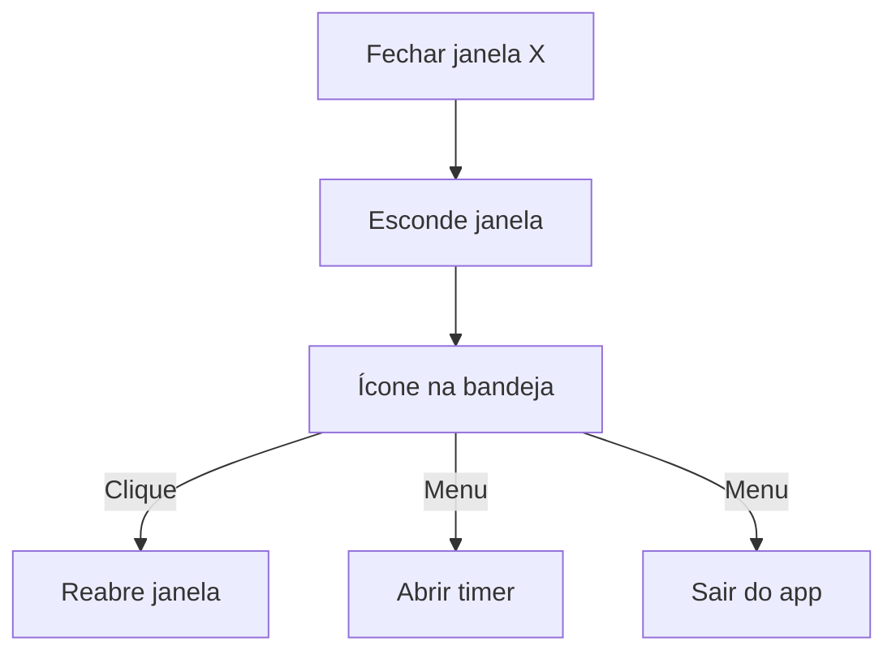

# 09 — Tray e sistema

| Campo | Valor |
|-------|-------|
| **Status** | `real` |
| **Prioridade** | `P1` |
## Visão geral

Comportamento nativo do agente: janela compacta, minimizar para bandeja, sessão continua em background, links externos no navegador do sistema.

## Janela

| Propriedade | Valor |
|-------------|-------|
| Tamanho padrão | ~480×620 px (configurável em `tauri.conf.json`) |
| Redimensionável | Sim |
| Fechar (X) | Minimiza para tray — **não encerra** o app |
| Tema | Dark com acento violeta (tokens Voowork) |

## System tray

Com sessão ativa e janela oculta:

- Activity tracker continua
- Screenshots continuam
- App focus poll continua
- Sync worker continua
- Idle overlay reaparece ao reabrir janela

## Navegação externa

Links para `voowork.com` e demais URLs abrem no **navegador padrão do SO** via `tauri-plugin-opener`.

Componente `ExternalLinkGuard` intercepta cliques em `<a>` para garantir comportamento correto.

## Notificações

Linux: `notify-rust` para alertas de idle (warning/countdown).

## Internacionalização

3 idiomas via i18next: `pt-BR`, `en`, `es`.

| Componente | Arquivo |
|------------|---------|
| Config i18n | `src/i18n/` |
| Toggle idioma | `src/components/language-toggle.tsx` |

## Tema

Persistido em SQLite (`settings`), não em `localStorage`.

| Componente | Arquivo |
|------------|---------|
| Provider | `src/components/theme-provider.tsx` |

## Arquivos principais

| Camada | Arquivo |
|--------|---------|
| Bootstrap | `src-tauri/src/lib.rs` |
| System tray | `src-tauri/src/tray.rs` |
| Navegação externa | `src-tauri/src/navigation.rs` |
| Config janela | `src-tauri/tauri.conf.json` |
| Permissões | `src-tauri/capabilities/default.json` |
| Links externos | `src/components/external-link-guard.tsx` |
| UI principal | `src/components/timer-app.tsx` |

## Comportamento esperado (alvo)

- [ ] Menu tray: "Pausar sessão" / "Encerrar sessão"
- [ ] Ícone dinâmico (gravando vs idle)
- [ ] Tooltip com tempo decorrido
- [ ] Auto-start no boot do SO (opcional, por org)
- [ ] Atualização silenciosa (auto-update Tauri)

## Edge cases

- **Quit pelo tray com sessão ativa:** deve parar sessão antes de encerrar (ou confirmar com usuário).
- **Múltiplas instâncias:** single-instance lock (futuro).
- **Wayland vs X11:** compatibilidade de tray e screenshots varia por compositor.

## Preferências locais

Configurações mínimas persistidas em SQLite (`settings`):

| Chave | Descrição | Padrão |
|-------|-----------|--------|
| `theme` | `dark` / `light` | `dark` |
| `locale` | `pt-BR` / `en` / `es` | Sistema |
| `idle_threshold_minutes` | Minutos sem input → warning | `2` |
| `idle_profile` | Perfil de threshold | `standard` |

Comandos: `get_setting`, `set_setting`, `get_idle_config`.

## Relacionado

- [03-session-tracking.md](./03-session-tracking.md) — sessão em background
