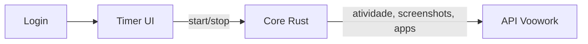

# Features — App timer (desktop)

Especificações das features do **agente timer** Voowork — o app desktop que o colaborador usa para registrar tempo e capturar atividade em background.

## Escopo

Este diretório documenta **somente** o app timer:

- Login compacto
- Seletor de projeto/task
- Sessão de tracking (start/stop, idle)
- Captura em background (atividade, app focus, screenshots)
- Persistência local e sync com a API
- Integridade e anti-fraude (core Rust)
- Comportamento nativo (tray, janela, i18n, tema)

## Índice

| Ordem | Feature | Arquivo | Status |
|-------|---------|---------|--------|
| 1 | Autenticação | [01-authentication.md](./01-authentication.md) | `real` / `parcial` |
| 2 | Registro de dispositivo | [07-device-registration.md](./07-device-registration.md) | `real` local |
| 3 | Projetos e tasks | [02-projects-and-tasks.md](./02-projects-and-tasks.md) | `real` |
| 4 | Sessão de tracking | [03-session-tracking.md](./03-session-tracking.md) | `real` |
| 5 | Monitoramento de atividade | [04-activity-monitoring.md](./04-activity-monitoring.md) | `real` |
| 6 | Screenshots | [05-screenshots.md](./05-screenshots.md) | `real` / `parcial` |
| 7 | Sync e offline | [06-sync-and-offline.md](./06-sync-and-offline.md) | `parcial` |
| 8 | Integridade e segurança | [08-integrity-and-security.md](./08-integrity-and-security.md) | `real` |
| 9 | Tray e sistema | [09-tray-and-system.md](./09-tray-and-system.md) | `real` |

## Diagrama

## Convenções das specs

1. **Metadados** — status, prioridade
2. **Visão geral** — propósito da feature
3. **Fluxos** — diagramas Mermaid quando aplicável
4. **Comandos Tauri** — interface UI ↔ Rust
5. **Modelo de dados** — tabelas SQLite relevantes
6. **Arquivos principais** — mapa para o código
7. **Alvo / roadmap** — o que falta implementar
8. **Relacionado** — links entre specs

**Status:** `mock` · `parcial` · `real` · `planejado`

**Prioridade:** `P0` (bloqueante) · `P1` (core) · `P2` (melhoria)

Arquivos citados são relativos à raiz do repositório.

## Documentação relacionada

- [PRODUCT.md](../PRODUCT.md) — visão de produto
- [BACKEND_INTEGRATION.md](../BACKEND_INTEGRATION.md) — matriz de integração desktop ↔ API
- [README.md](../../README.md) — setup e desenvolvimento
